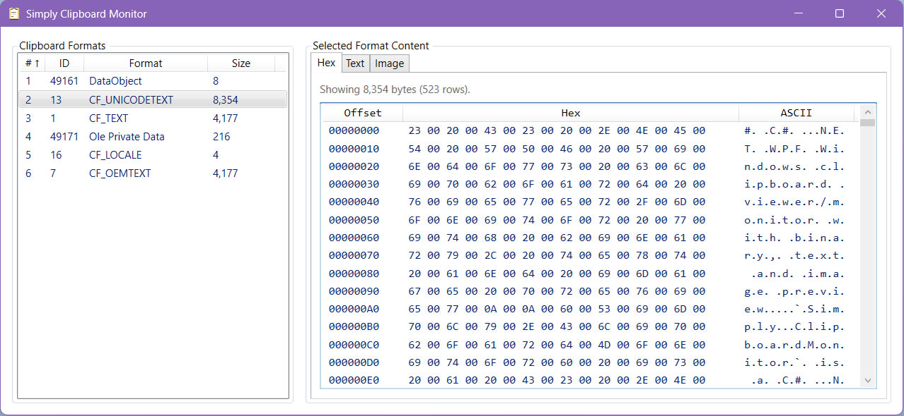

# C# .NET WPF Windows clipboard viewer/monitor with binary, text and image preview

`Simply.ClipboardMonitor` is a C# .NET WPF Windows desktop app for inspecting the current clipboard contents in real time.

It shows:
- The list of data formats currently available in the clipboard.
- Raw bytes as a hex dump (when the format is byte-addressable).
- Decoded text preview (for text-like formats).
- Image preview (for image-like formats).

## Download Binaries

Pre-built portable binaries are available from the [GitHub releases page](../../releases/latest).

If you wish to build from source, follow [Build and Run](#build-and-run) instructions.

## What This Project Is For

The app is designed as a clipboard debugging and inspection utility for software developers, QA engineers, and power users who need to understand exactly what an application places on the Windows clipboard.

## Intended Uses

- Debug clipboard integrations in your own apps.
- Validate which formats are published at copy time (e.g. text, HTML, custom formats, DIB).
- Inspect raw clipboard payloads via hex rows and offsets.
- Quickly sanity-check text encoding behavior (`CF_TEXT`, `CF_OEMTEXT`, `CF_UNICODETEXT`).
- Preview clipboard images and verify basic rendering.

## Potential Uses

- Reverse engineering clipboard behavior of third-party apps.
- Creating reproducible bug reports for clipboard-related issues.
- Comparing clipboard outputs across different apps for compatibility testing.
- Learning how Win32 clipboard formats map to real payloads.

## How It Works

At runtime, the main window registers as a clipboard listener using `AddClipboardFormatListener`.  
Whenever Windows sends `WM_CLIPBOARDUPDATE`, the app:

1. Opens the clipboard (with retry).
2. Enumerates available format IDs with `EnumClipboardFormats`.
3. Resolves display names (well-known map + `GetClipboardFormatName`).
4. Attempts to read format size (`GlobalSize`) for HGLOBAL-backed formats.
5. Updates the format list UI.

When you select a format:

1. The app reads bytes via `GetClipboardData` + `GlobalLock`/`GlobalUnlock` (if supported for that format).
2. It renders a lazy hex table (16 bytes per row).
3. It attempts text decoding for text-like formats.
4. It attempts image decoding for image-like formats.

## Preview Behavior

### Hex
- Available only for byte-addressable clipboard data.
- Rows show offset, hex bytes, and ASCII view.
- Uses lazy row materialization to keep large payload display responsive.

### Text
- Enabled for classic text IDs and text-like format names (`text`, `html`, `rtf`, `xml`, `json`, `csv`).
- Decoding strategy:
  - `CF_UNICODETEXT`: UTF-16.
  - `CF_TEXT`: system ANSI/default code page.
  - `CF_OEMTEXT`: system OEM code page.
  - Others: UTF-8 (strict/BOM-aware) with fallback to default encoding.

### Image
- Attempts image preview for DIB IDs (`CF_DIB`, `CF_DIBV5`) and image-like names (`png`, `jpeg`, `gif`, `bitmap`, etc.).
- DIB data is converted in-memory to a BMP stream before decoding.
- Includes fit-to-viewport baseline scale and user zoom multiplier.

## Known Limitations

- Some clipboard formats use non-HGLOBAL handles (for example `CF_BITMAP`, `CF_METAFILEPICT`), so raw byte preview is intentionally unavailable.
- There are no automated tests in this repository currently.

## Tech Stack

- C#
- WPF
- .NET 8 (`net8.0-windows`)
- Win32 clipboard APIs via P/Invoke (`user32.dll`, `kernel32.dll`)

## Project Structure

- `Simply.ClipboardMonitor.sln` - solution
- `Simply.ClipboardMonitor/Simply.ClipboardMonitor.csproj` - app project
- `Simply.ClipboardMonitor/MainWindow.xaml` - UI layout
- `Simply.ClipboardMonitor/MainWindow.xaml.cs` - core logic (clipboard listener, parsing, previews)

## Build and Run

1. Ensure you have the .NET 8 SDK installed on your machine (`dotnet --list-sdks`).
2. Clone the repository.
3. Navigate to the root directory of the repository (where `Simply.ClipboardMonitor.sln` file is located).
4. For debug builds:
	* Execute `dotnet run`.
5. For release builds:
	* Execute `dotnet run --project Simply.ClipboardMonitor\Simply.ClipboardMonitor.csproj -c Release`.

## License

MIT License; see `LICENSE.txt`.
