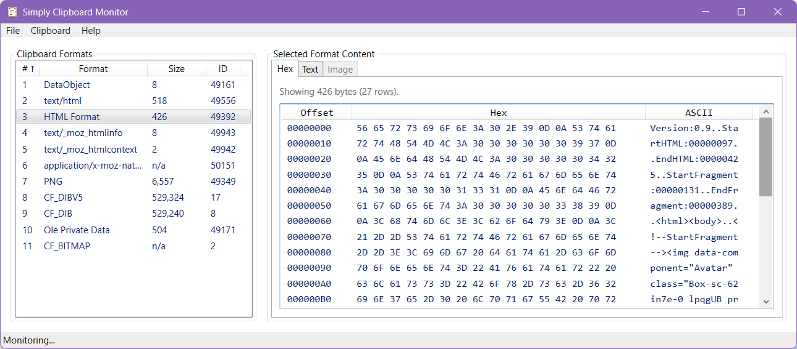
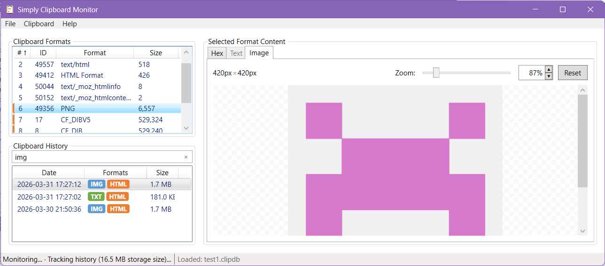

# C# .NET WPF Windows clipboard viewer/monitor with binary, text and image preview

`Simply.ClipboardMonitor` is a C# .NET WPF Windows desktop app for inspecting the current clipboard contents in real time.

It shows:
- The list of data formats currently available in the clipboard.
- Raw bytes as a hex dump (when the format is byte-addressable).
- Decoded text preview (for text-like formats), with encoding detection and a manual encoding selector.
- Image preview (for image-like formats).
- A scrollable history of past clipboard changes, with per-session format previews.




## Download Binaries

Pre-built portable binaries are available from the [GitHub releases page](../../releases/latest).

If you wish to build from source, follow [Build and Run](#build-and-run) instructions.

## What This Project Is For

The app is designed as a clipboard debugging and inspection utility for software developers, QA engineers, and power users who need to understand exactly what an application places on the Windows clipboard.

## Intended Uses

- Debug clipboard integrations in your own apps.
- Validate which formats are published at copy time (e.g. text, HTML, custom formats, DIB).
- Inspect raw clipboard payloads via hex rows and offsets.
- Quickly sanity-check text encoding behavior (`CF_TEXT`, `CF_OEMTEXT`, `CF_UNICODETEXT`).
- Preview clipboard images and verify basic rendering.
- Browse and replay clipboard history — inspect any past clipboard state in full detail.
- Save a clipboard snapshot to a `.clipdb` file for later analysis or sharing.
- Export an individual clipboard format as text, image, or raw binary file.

## Potential Uses

- Reverse engineering clipboard behavior of third-party apps.
- Creating reproducible bug reports for clipboard-related issues.
- Comparing clipboard outputs across different apps for compatibility testing.
- Learning how Win32 clipboard formats map to real payloads.

## How It Works

At runtime, the main window registers as a clipboard listener using `AddClipboardFormatListener`.
Whenever Windows sends `WM_CLIPBOARDUPDATE` and clipboard change monitoring is active, the app:

1. Opens the clipboard (with retry).
2. Enumerates available format IDs with `EnumClipboardFormats`.
3. Resolves display names (well-known map + `GetClipboardFormatName`).
4. Reads the data size for each format — strategy depends on handle type:
   - **HGLOBAL formats** (`CF_DIB`, `CF_UNICODETEXT`, custom formats, etc.): `GlobalSize`.
   - **HBITMAP formats** (`CF_BITMAP`, `CF_DSPBITMAP`): `GetObject` → stride × height.
   - **HENHMETAFILE formats** (`CF_ENHMETAFILE`, `CF_DSPENHMETAFILE`): `GetEnhMetaFileBits` with a zero-length buffer.
5. Updates the format list UI.

When you select a format:

1. The app reads bytes via `GetClipboardData`, then extracts them using a strategy matched to the handle type:
   - **HGLOBAL**: `GlobalLock` / `GlobalUnlock` copy.
   - **HBITMAP**: `GetDIBits` converts the GDI bitmap to an uncompressed 32 bpp DIB byte block.
   - **HENHMETAFILE**: `GetEnhMetaFileBits` copies the raw EMF stream.
2. It renders a lazy hex table (16 bytes per row).
3. It attempts text decoding for text-like formats.
4. It attempts image decoding for image-like formats.

### Saving and Loading (.clipdb files)

Use **File → Save As…** to snapshot the current clipboard to a `.clipdb` file. Use **File → Save** to overwrite the most recently loaded or saved file. Use **File → Load…** to restore a snapshot into the clipboard.

Internally a `.clipdb` file is a SQLite database with two tables:

- `data_blobs` — stores each distinct binary payload once, keyed by its SHA-256 hash. Identical payloads across formats are stored only once.
- `clipboard_formats` — one row per clipboard format, recording the format ID, name, handle type (`hglobal` / `hbitmap` / `henhmetafile` / `none`), and a reference to the data blob.

On load, each format is restored using the handle-type-appropriate Win32 call:
- **HGLOBAL** formats: `GlobalAlloc` + `SetClipboardData`.
- **HBITMAP** formats: `CreateDIBitmap` (rebuilds a GDI bitmap from the stored 32 bpp DIB block) + `SetClipboardData`.
- **HENHMETAFILE** formats: `SetEnhMetaFileBits` + `SetClipboardData`.
- Custom format names (IDs ≥ 0xC000) are re-registered with `RegisterClipboardFormat` before writing, so format IDs remain correct even if they changed between Windows sessions.

## Clipboard Monitoring

Clipboard change monitoring is **enabled by default**. When active, the format list refreshes automatically every time the clipboard contents change.

### Turning monitoring ON and OFF

Use **Clipboard → Monitor Changes** in the menu bar to toggle monitoring on or off.

The menu item displays a checkmark and the status bar at the bottom shows "Monitoring..." while monitoring is active.

When monitoring is turned off, a full snapshot of all current clipboard format data is taken automatically so that format previews remain functional even when the clipboard contents have since changed.

### Persisted preference

The monitoring state is saved automatically when changed and restored on the next launch. The preference is stored in `%LOCALAPPDATA%\Simply.ClipboardMonitor\preferences.json`.

## Clipboard History

Use **Clipboard → Track History** to enable history tracking. A history panel appears below the format list, showing a timestamped record of every clipboard change captured while **Track History** was active.

### History list

Each row in the history list shows:
- **Date** - timestamp of the clipboard change.
- **Formats** — colored badges identifying the data categories present in that clipboard snapshot. The tooltip shows a list of every format name and its ID in the snapshot.

  | Pill | Category | Formats matched |
  |------|----------|-----------------|
  | **IMG** | Image | `CF_DIB`, `CF_DIBV5`, `CF_BITMAP`, PNG, JPEG, GIF, etc. |
  | **TXT** | Text | `CF_TEXT`, `CF_UNICODETEXT`, `CF_OEMTEXT`, and text-like format names |
  | **HTML** | HTML | `HTML Format` and HTML-like format names |
  | **RTF** | Rich Text | `Rich Text Format` and RTF-like format names |
  | **FILE** | File drop | `CF_HDROP` |
  | **OTHER** | Other | Shown only when none of the above apply |
- **Size** — sum of the original (uncompressed) byte lengths of all formats in the snapshot.

Clicking a row retrieves that session's format snapshots for preview, exactly as they were at the time of capture. If a clipboard format was already selected in the format list and the new session contains a format with the same name, that format is automatically re-selected so the preview refreshes immediately without extra clicks. Likewise, the active content preview tab (Hex / Text / Image) is preserved across row changes, allowing rapid inspection of the same data view across multiple history entries.

The number of entries currently visible is shown in the **Clipboard History** group header (right-aligned). When a filter is active it reads *N items (M total)*, where *M* is the total unfiltered session count and *N* is the number of matched entries.

### History entry actions

Right-clicking a row in the history list opens a context menu:

| Action | Description |
|--------|-------------|
| **Load into Clipboard** | Replaces the current clipboard with the full contents of the selected history entry. Available only when the entry differs from what is already on the clipboard; loading triggers a new history entry just like any other clipboard change. |
| **Save As…** | Opens a **Save As** dialog and saves the selected history entry to a `.clipdb` file without touching the live clipboard. |
| **Delete** | Permanently removes the selected entry. The format list reverts to the current live clipboard. |
| **Clear All** | Deletes all history entries (equivalent to **File → Settings → Clear History**). The format list reverts to the current live clipboard. |

### Startup and toggle-on capture

When **Track History** is enabled — either because it was on at last exit and is restored on startup, or because the user enables it manually — the current clipboard contents are automatically captured as a new history entry if they differ from the most recently recorded session. If the clipboard matches the last entry, that entry is selected instead. This ensures the history list always starts with the current clipboard state.

### Filtering

A filter box sits at the top of the history panel. Typing text in narrows the list to sessions whose timestamp, format pill labels, format names, or decoded text content contains the search term.

- The search is case-insensitive.
- The group header count updates to show *N items (M total)* while a filter is active, making it easy to see how many sessions matched.
- When a session is selected while a filter is active, format rows that match the filter term are highlighted with an orange left border.
  - Format rows are highlighted when the filter term appears in the **format name** or in the format's **pill label** (e.g. typing `img` highlights every image-compatible format, not only those whose registered name contains those letters).
- Clearing the filter (typing or clicking **×**) reloads the full list and automatically selects the latest session.
- New clipboard events captured while a filter is active re-run the filtered query; the format panel remains unchanged if the new session does not match the current filter.

### History database

History is persisted to `%LOCALAPPDATA%\Simply.ClipboardMonitor\history.db` (an SQLite database). Blob data is stored compressed (ZStandard at maximum level) and content-addressed by SHA-256 hash, so identical payloads shared across different formats and different sessions are stored only once.

The database schema has four tables:
- `clipboard_formats` — the set of all format names and IDs ever seen.
- `clipboard_contents` — deduplicated compressed blobs, keyed by SHA-256 hash.
- `sessions` — one row per clipboard change, with timestamp, formats summary text, total uncompressed size, and a space-separated list of pill labels (`pills_text`) used for fast pill-label filtering.
- `session_items` — joins sessions to their per-format blobs; includes a `text_content` column storing the decoded text for text-like formats, used for full-text filtering.

The schema is migrated automatically on first launch after an upgrade — new columns are added with `ALTER TABLE … ADD COLUMN` when they are missing, so existing databases are upgraded in place without data loss.

### History limits

The history database grows over time. Use **File → Settings** to configure:
- **Max entries** — oldest sessions are deleted when the count exceeds this value.
- **Max database size (MB)** — oldest sessions are deleted until the total stored blob size falls below this limit. At least one session is always retained.

Limits are enforced automatically each time a new session is written, as well as when the user changes the limits in the Settings dialog.

The Settings dialog also shows the current database file size and provides a **Clear History** button.

When history tracking is active, the status bar shows "Tracking history (X.X MB storage size)...".

## System Tray

The application can be kept running in the system tray instead of closing when the main window is dismissed.

### Enabling Minimize to System Tray

Open **File → Settings** and check **Minimize to System Tray**. When the setting is ON:

- The system tray icon is visible at all times while the application is running.
- Closing the main window hides it rather than exiting. The first time the window is hidden this way, a balloon notification appears to confirm the application is still running.
- Left-clicking the tray icon toggles the window between visible and hidden.
- Right-clicking the tray icon opens a context menu with two entries:
  - **Show/Hide Window** — toggles window visibility.
  - **Exit** — closes the application immediately without hiding to the tray.
- **File → Exit** always exits the application, regardless of the setting.

## Auto-Start

Open **File → Settings** to configure how the application starts.

### Start at login

When **Start at login** is ON, the application registers itself in the Windows current-user auto-start registry key (`HKCU\Software\Microsoft\Windows\CurrentVersion\Run`) so it launches automatically after login. Disabling the setting removes the entry immediately.

The status bar shows an orange **AUTO-START** pill on the right edge whenever this setting is ON, providing a persistent visual reminder.

### Start minimized

When **Start minimized** is ON, the application window does not appear on screen at startup:

- If **Minimize to System Tray** is also ON — the window is hidden and the tray icon is shown (same as manually closing the window with the tray option enabled).
- If **Minimize to System Tray** is OFF — the window starts minimized in the taskbar.

### Persisted preference

The **Minimize to System Tray** setting is saved in `%LOCALAPPDATA%\Simply.ClipboardMonitor\preferences.json` along with a flag that tracks whether the first-minimize balloon notification has been shown (so it appears only once ever). **Start at login** state is read directly from the registry on each launch so the UI always reflects the actual system state.

## Preview Behavior

### Hex
- Available only for byte-addressable clipboard data.
- Rows show offset, hex bytes, and ASCII view.
- Uses lazy row materialization to keep large payload display responsive.

### Text
- Enabled for classic text IDs and text-like format names (`text`, `html`, `rtf`, `xml`, `json`, `csv`).
- Decoding strategy:
  - `CF_UNICODETEXT`: UTF-16 LE.
  - `CF_TEXT`: system ANSI/default code page.
  - `CF_OEMTEXT`: system OEM code page (e.g. CP437).
  - Others: UTF-8 BOM → UTF-16 BOM/heuristic → strict UTF-8 → system default.
- Status line shows character count, non-whitespace character count, and line count. Any of `\r`, `\n`, or `\r\n` counts as a line separator.
- An **Encoding** drop-down lists all encodings supported by Windows. The auto-detected encoding is pre-selected. Selecting a different encoding re-decodes the raw bytes on the spot; decoding failures are shown inline in red.
- The manually selected encoding is used when exporting as `.txt` (see below).

### Image
- Attempts image preview for:
  - **DIB formats** (`CF_DIB`, `CF_DIBV5`): the raw DIB block is prefixed with a `BITMAPFILEHEADER` and decoded by WPF's `BitmapDecoder`.
  - **HBITMAP formats** (`CF_BITMAP`, `CF_DSPBITMAP`): converted to a 32 bpp DIB via `GetDIBits`, then decoded the same way as DIB formats above.
  - **Encoded image formats** (names containing `png`, `jpeg`, `gif`, etc.): decoded directly from the byte stream.
- Includes fit-to-viewport baseline scale and user zoom multiplier (Ctrl + mouse wheel or zoom controls).
- Middle mouse button pans the image inside the scroll viewer.

### Exporting a format

Use **File → Export Selected Format…** (`Ctrl+E`) to save the currently selected clipboard format to a file. The command is disabled when no format is selected or the format has no captured data (Size = n/a).

A **Save As** dialog opens with the file name pre-set to `clipboard-{format_name}-{timestamp}`. The available file types depend on what previews are active for the selected format:

| Extension | Availability | Default when… |
|-----------|-------------|---------------|
| `.txt` | Text preview is available | Text preview is available |
| `.png` | Image preview is available | Image preview is available and format is not a JPEG |
| `.jpg` | Image preview is available | Format is a JPEG image (e.g. `image/jpeg`) |
| `.bin` | Always | No other format applies |

- **`.txt`** — decodes the raw bytes using the auto-detected encoding. If the Text tab is active and the encoding was manually changed, the manually selected encoding is used instead.
- **`.png`** — re-encodes the current image preview as a PNG file.
- **`.jpg`** — for natively JPEG clipboard formats writes the raw bytes unchanged; for all other image sources re-encodes at 80% quality.
- **`.bin`** — writes the raw clipboard bytes as-is.

## Known Limitations

- **`CF_PALETTE` (HPALETTE)**: palette objects cannot be read as a raw byte stream. The format appears in the list but has no hex, image, or save/restore support.
- **`CF_ENHMETAFILE` / `CF_DSPENHMETAFILE`** (HENHMETAFILE): the raw EMF byte stream is available in the hex viewer and is saved/restored correctly, but no image rendering is provided — WPF has no native EMF decoder and rendering via GDI is outside the current scope.
- **`CF_METAFILEPICT` / `CF_DSPMETAFILEPICT`** (HGLOBAL wrapping a `METAFILEPICT` struct): the hex viewer shows the raw struct bytes; the embedded `HMETAFILE` handle value inside is not dereferenced and the metafile data is not separately captured.
- There are no image-rendering tests for `CF_ENHMETAFILE` / `CF_DSPENHMETAFILE` and no UI-level tests.

## Tech Stack

- C#
- WPF
- .NET 8 (`net8.0-windows`)
- Win32 APIs via P/Invoke (`user32.dll`, `kernel32.dll`, `gdi32.dll`, `shell32.dll`)
- SQLite via `Microsoft.Data.Sqlite` (clipboard database persistence and history)
- ZStandard via `ZstdSharp.Port` (history blob compression)
- `Microsoft.Extensions.DependencyInjection` (constructor injection throughout)
- `System.Drawing.Common` (system tray icon loading)

## Project Structure

- `Simply.ClipboardMonitor.sln` — solution
- `Simply.ClipboardMonitor/Simply.ClipboardMonitor.csproj` — app project
- `Simply.ClipboardMonitor.Tests/Simply.ClipboardMonitor.Tests.csproj` — xUnit test project
- `Simply.ClipboardMonitor/App.xaml` / `App.xaml.cs` — WPF application entry point; builds the DI container and registers all services, strategies, and exporters
- `Simply.ClipboardMonitor/Views/MainWindow.xaml` / `MainWindow.xaml.cs` — main window (clipboard listener, format list, previews, history, export, sort, preferences)
- `Simply.ClipboardMonitor/Views/AboutDialog.xaml` / `AboutDialog.xaml.cs` — About dialog
- `Simply.ClipboardMonitor/Views/SettingsDialog.xaml` / `SettingsDialog.xaml.cs` — Settings dialog (history limits, database size display, clear history, minimize-to-tray, start-at-login, start-minimized toggles)

### Models
Data-transfer records and plain model classes with no service dependencies.

- `Models/ClipboardFormatItem.cs` — format list row model (ordinal, ID, name, content size, filter-highlight flag)
- `Models/EncodingItem.cs` — encoding display name + `Encoding` pair for the encoding combo box
- `Models/FormatColumnPreference.cs` — saved column width preference
- `Models/FormatExportContext.cs` — context record passed to `IFormatExporter` implementations
- `Models/FormatPill.cs` — colored badge record (label + brush) for the history Formats column
- `Models/FormatSnapshot.cs` — point-in-time capture of one clipboard format (handle type, raw bytes, original size)
- `Models/SavedClipboardFormat.cs` — format row stored in / loaded from a `.clipdb` file
- `Models/SessionEntry.cs` — one row from the history sessions table
- `Models/TextDecodeResult.cs` — result of a single text-decode attempt (text, encoding, success/failure)
- `Models/UserPreferences.cs` — top-level user preferences (sort property/direction, monitor/history settings, limits, minimize-to-tray, start-at-login, start-minimized toggles, balloon-shown flag)

### Services
Public domain service interfaces consumed by the main window and DI wiring.

- `Services/IClipboardFileRepository.cs` — save/load clipboard snapshots to `.clipdb` files
- `Services/IClipboardReader.cs` — enumerate and read current clipboard formats; capture full snapshots
- `Services/IClipboardWriter.cs` — restore saved formats back onto the clipboard
- `Services/IFormatClassifier.cs` — classify formats into colored pills and tooltip text for the history list
- `Services/IFormatExporter.cs` — export a clipboard format to a file (one implementation per output type)
- `Services/IHistoryMaintenance.cs` — database maintenance operations (schema migration, enforce size limits, clear history)
- `Services/IHistoryRepository.cs` — clipboard history persistence (add session, load sessions with optional filter, load session formats, delete a single session, total session count, duplicate detection)
- `Services/IImagePreviewService.cs` — create WPF `BitmapSource` previews from raw clipboard bytes
- `Services/IPreferencesService.cs` — load and save user preferences
- `Services/ITextDecodingService.cs` — decode raw bytes as text with auto-detection or manual encoding override

### Services/Impl
Concrete service implementations. All classes are `internal sealed`.

- `Services/Impl/IHandleReadStrategy.cs` — internal strategy interface for reading a specific clipboard handle type
- `Services/Impl/IHandleWriteStrategy.cs` — internal strategy interface for restoring a specific clipboard handle type
- `Services/Impl/ClipboardFileRepository.cs` — `.clipdb` save/load (SQLite, SHA-256 content deduplication)
- `Services/Impl/ClipboardReaderService.cs` — Win32 clipboard reading; dispatches per-handle-type work to injected `IHandleReadStrategy` implementations
- `Services/Impl/ClipboardWriterService.cs` — Win32 clipboard writing; dispatches per-handle-type work to injected `IHandleWriteStrategy` implementations
- `Services/Impl/FormatClassifierService.cs` — produces colored pills and tooltip text for the history list
- `Services/Impl/HistoryRepository.cs` — history database (SQLite, ZStandard compression, SHA-256 deduplication, session trimming, single-session deletion with orphan cleanup, schema migration, duplicate detection); implements both `IHistoryRepository` and `IHistoryMaintenance`
- `Services/Impl/ImagePreviewService.cs` — decodes DIB, HBITMAP-derived, and encoded image formats into WPF `BitmapSource` objects
- `Services/Impl/PreferencesService.cs` — JSON preferences persisted to `%LOCALAPPDATA%\Simply.ClipboardMonitor\preferences.json`
- `Services/Impl/TextDecodingService.cs` — text decoding with format-aware priority chain and UTF-16 heuristics

### Services/Impl/Strategies
One class per clipboard handle type or export file format. All classes are `internal sealed`.

- `Strategies/NoneHandleReadStrategy.cs` — "none" handle type (e.g. `CF_PALETTE`): returns a failure message; no data read
- `Strategies/HGlobalHandleReadStrategy.cs` — HGLOBAL: `GlobalLock` / `GlobalUnlock` byte copy
- `Strategies/HBitmapHandleReadStrategy.cs` — HBITMAP: converts to 32 bpp DIB via `GetDIBits`
- `Strategies/HEnhMetaFileHandleReadStrategy.cs` — HENHMETAFILE: raw EMF bytes via `GetEnhMetaFileBits`
- `Strategies/HGlobalHandleWriteStrategy.cs` — HGLOBAL restore: `GlobalAlloc` + `SetClipboardData`
- `Strategies/HBitmapHandleWriteStrategy.cs` — HBITMAP restore: `CreateDIBitmap` + `SetClipboardData`
- `Strategies/HEnhMetaFileHandleWriteStrategy.cs` — HENHMETAFILE restore: `SetEnhMetaFileBits` + `SetClipboardData`
- `Strategies/TextFormatExporter.cs` — exports as `.txt` using the auto-detected or manually selected encoding
- `Strategies/PngFormatExporter.cs` — exports image preview as `.png`
- `Strategies/JpegFormatExporter.cs` — exports as `.jpg` (raw bytes for native JPEG formats; re-encoded at quality 80 otherwise)
- `Strategies/BinaryFormatExporter.cs` — exports raw bytes as `.bin` (always-available fallback)

### Common
Internal utility types with no domain logic.

- `Common/AutoStartHelper.cs` — reads and writes the Windows current-user auto-start registry key
- `Common/ClipboardFormatConstants.cs` — Windows clipboard format ID constants (`CF_TEXT`, `CF_BITMAP`, etc.), handle-type classification sets, and shared image-format detection
- `Common/DisplayHelper.cs` — shared display formatting utilities (human-readable byte-size strings)
- `Common/HexRow.cs` — single hex-dump display row (offset, hex bytes, ASCII)
- `Common/HexRowCollection.cs` — lazy-loaded, cached `IReadOnlyList<HexRow>` over a raw byte array
- `Common/NativeMethods.cs` — Win32 P/Invoke declarations (`user32.dll`, `kernel32.dll`, `gdi32.dll`, `shell32.dll`)
- `Common/ShellHelper.cs` — opens a URL in the default browser via `ShellExecute`
- `Common/Win32Structs.cs` — Win32 GDI structs used by clipboard read/write (`BITMAP`, `BITMAPINFOHEADER`)

## Tests

The solution includes an xUnit test project (`Simply.ClipboardMonitor.Tests`) targeting `net8.0-windows`. Run tests with:

```
dotnet test
```

The test suite covers:

| File | What is tested |
|------|---------------|
| `TextDecodingServiceTests` | `IsTextCompatible`, `Decode` (all format ID branches and all auto-detection paths — UTF-8 BOM, UTF-16 LE/BE BOM, heuristic, fallback), `DecodeWith`, `GetDecodedTextStats` (including `\r`, `\n`, `\r\n` variants) |
| `FormatClassifierServiceTests` | `GetFormatPillLabel` for every category and the null/OTHER fallback; `ComputePills` including the "OTHER is suppressed when any known category matches" rule; `ComputeTooltip` singular/plural/empty |
| `DisplayHelperTests` | Zero, byte, KB, MB, GB boundary values; correct decimal rounding at 1.5× scale in all three ranges |
| `HexRowCollectionTests` | Row count (empty/exact/partial), offset formatting, hex pair content and padding, ASCII printable/non-printable mapping, out-of-range indexer, row caching, enumeration |
| `HistoryRepositoryTests` | `GetSessionCount`, `AddSession` with and without trim, `LoadSessions` (order, filter match/no-match), `LoadSessionFormats` with byte round-trip, `DeleteSession` (count, format removal, other sessions unaffected, shared blob preservation), `ClearHistory`, `IsDuplicateOfLastSession`, `EnforceLimits` (verifies the *oldest* sessions are removed), `BuildFormatsText` (name and truncation) |

`HistoryRepositoryTests` are integration tests that write to a temporary SQLite file created per test class instance; each directory is deleted in `Dispose`.

`FormatClassifierServiceTests` run on an STA thread (`[StaFact]` from `Xunit.StaFact`) because `FormatClassifierService` creates frozen `SolidColorBrush` objects in its static initialiser.

## Build and Run

1. Ensure you have the .NET 8 SDK installed on your machine (`dotnet --list-sdks`).
2. Clone the repository.
3. Navigate to the root directory of the repository (where `Simply.ClipboardMonitor.sln` file is located).
4. For debug builds:
	* Execute `dotnet run`.
5. For release builds:
	* Execute `dotnet run --project Simply.ClipboardMonitor\Simply.ClipboardMonitor.csproj -c Release`.

## License

MIT License; see `LICENSE.txt`.
